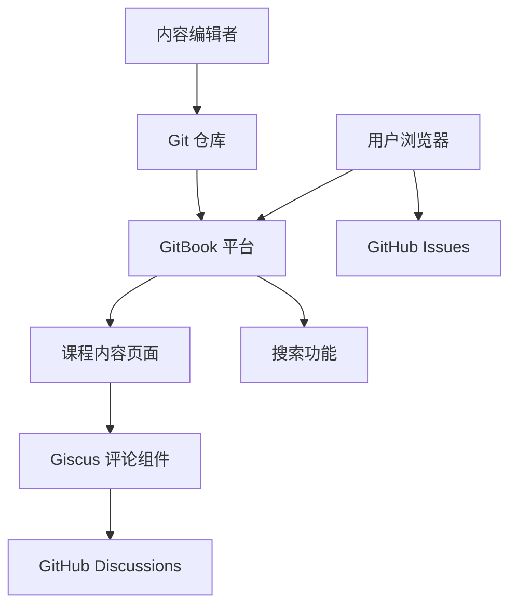

# Design Document

## Overview

本设计文档描述了基于 GitBook 的社团课程学习平台的技术架构和实现方案。该平台将使用 GitBook 作为核心文档系统，集成 GitHub Issues 作为问题收集系统，并使用 GitBook 的评论功能或第三方评论系统（如 Giscus）实现讨论功能。

## Architecture

### 技术栈选择

1. **文档系统**: GitBook (官方平台或自托管)
2. **内容管理**: Git + GitHub/GitLab (通过 Git Sync)
3. **问题追踪**: GitHub Issues
4. **评论系统**: Giscus (基于 GitHub Discussions)
5. **部署方式**: GitBook 官方托管或自定义域名

### 系统架构图



## Components and Interfaces

### 1. GitBook 配置组件

**职责**: 配置 GitBook 项目结构和内容组织

**关键文件**:
- `.gitbook.yaml`: GitBook 配置文件
- `SUMMARY.md`: 目录结构定义
- `README.md`: 首页内容
- 课程内容 Markdown 文件

**配置示例**:
```yaml
root: ./
structure:
  readme: README.md
  summary: SUMMARY.md
```

### 2. 内容组织组件

**职责**: 组织课程内容的层级结构

**目录结构**:
```
/
├── .gitbook.yaml
├── README.md
├── SUMMARY.md
├── courses/
│   ├── chapter-01/
│   │   ├── README.md
│   │   ├── lesson-01.md
│   │   └── lesson-02.md
│   ├── chapter-02/
│   │   └── ...
│   └── ...
├── resources/
│   ├── images/
│   └── files/
└── .github/
    └── ISSUE_TEMPLATE/
        └── question.md
```

### 3. GitHub Issues 集成组件

**职责**: 提供问题收集和追踪功能

**实现方式**:
- 在 GitBook 页面中添加"提交问题"链接
- 链接指向 GitHub Issues 页面
- 使用 Issue 模板规范问题提交格式

**Issue 模板示例**:
```markdown
---
name: 学习问题
about: 提交课程学习中遇到的问题
title: '[问题] '
labels: question
---

**相关课程章节**:
<!-- 请填写章节名称 -->

**问题描述**:
<!-- 详细描述你遇到的问题 -->

**期望的帮助**:
<!-- 你希望获得什么样的帮助 -->
```

### 4. Giscus 评论系统组件

**职责**: 在每个课程页面提供讨论功能

**技术选择**: Giscus
- 基于 GitHub Discussions
- 支持 Markdown
- 支持回复和点赞
- 无需后端服务器
- 免费且开源

**集成方式**:
1. 在 GitHub 仓库启用 Discussions 功能
2. 在 Giscus 官网配置并获取嵌入代码
3. 在 GitBook 页面底部添加 Giscus 组件

**Giscus 配置示例**:
```html
<script src="https://giscus.app/client.js"
        data-repo="[REPO]"
        data-repo-id="[REPO_ID]"
        data-category="[CATEGORY]"
        data-category-id="[CATEGORY_ID]"
        data-mapping="pathname"
        data-strict="0"
        data-reactions-enabled="1"
        data-emit-metadata="0"
        data-input-position="bottom"
        data-theme="preferred_color_scheme"
        data-lang="zh-CN"
        crossorigin="anonymous"
        async>
</script>
```

### 5. Git Sync 组件

**职责**: 实现 GitBook 与 Git 仓库的自动同步

**工作流程**:
1. 内容编辑者在 Git 仓库中更新 Markdown 文件
2. 提交并推送到远程仓库
3. GitBook 自动检测变更并重新构建
4. 更新后的内容自动发布

**配置步骤**:
- 在 GitBook 中连接 GitHub 仓库
- 选择要同步的分支（通常是 main 或 master）
- 配置自动同步或手动触发

## Data Models

### 课程内容模型

```typescript
interface Course {
  id: string;
  title: string;
  description: string;
  chapters: Chapter[];
}

interface Chapter {
  id: string;
  title: string;
  order: number;
  lessons: Lesson[];
}

interface Lesson {
  id: string;
  title: string;
  content: string; // Markdown 格式
  order: number;
  filepath: string;
}
```

### Issue 模型

```typescript
interface Issue {
  id: number;
  title: string;
  body: string;
  labels: string[];
  state: 'open' | 'closed';
  author: string;
  createdAt: Date;
  comments: Comment[];
}

interface Comment {
  id: number;
  body: string;
  author: string;
  createdAt: Date;
}
```

### 讨论模型（Giscus）

```typescript
interface Discussion {
  id: string;
  title: string;
  url: string;
  comments: DiscussionComment[];
}

interface DiscussionComment {
  id: string;
  body: string;
  author: {
    login: string;
    avatarUrl: string;
  };
  createdAt: Date;
  replies: DiscussionComment[];
}
```

## Error Handling

### 1. 内容加载错误

**场景**: GitBook 页面加载失败或内容不可用

**处理方式**:
- GitBook 自动提供 404 页面
- 在 SUMMARY.md 中确保所有链接有效
- 定期检查死链

### 2. Git Sync 失败

**场景**: Git 仓库与 GitBook 同步失败

**处理方式**:
- 在 GitBook 控制台查看同步日志
- 检查 .gitbook.yaml 配置是否正确
- 验证文件路径和 Markdown 语法
- 手动触发重新同步

### 3. 评论系统加载失败

**场景**: Giscus 评论组件无法加载

**处理方式**:
- 检查 GitHub Discussions 是否启用
- 验证 Giscus 配置参数
- 确保仓库是公开的
- 提供备用联系方式（如 Issue 链接）

### 4. Issue 提交失败

**场景**: 用户无法提交 GitHub Issue

**处理方式**:
- 确保用户已登录 GitHub
- 检查仓库 Issues 功能是否启用
- 提供清晰的错误提示
- 提供备用反馈渠道（如邮件）

## Testing Strategy

### 1. 内容测试

**测试内容**:
- Markdown 语法正确性
- 链接有效性
- 图片资源可访问性
- 代码块语法高亮

**测试方法**:
- 使用 Markdown linter 检查语法
- 使用链接检查工具验证所有链接
- 本地预览所有页面
- 在不同设备上测试响应式布局

### 2. Git Sync 测试

**测试场景**:
- 新增内容文件
- 修改现有内容
- 删除内容文件
- 更新 SUMMARY.md

**测试方法**:
- 在测试分支进行变更
- 验证 GitBook 自动同步
- 检查内容更新是否正确显示
- 验证目录结构更新

### 3. 集成测试

**测试场景**:
- Giscus 评论功能
- GitHub Issues 链接
- 搜索功能
- 导航功能

**测试方法**:
- 在实际环境中测试评论发布和回复
- 验证 Issue 模板和提交流程
- 测试搜索关键词准确性
- 验证所有导航链接

### 4. 用户验收测试

**测试场景**:
- 新用户首次访问体验
- 内容阅读流畅性
- 问题提交流程
- 讨论参与体验

**测试方法**:
- 邀请社团成员进行测试
- 收集用户反馈
- 记录使用问题
- 迭代改进

## Deployment Strategy

### 部署选项

**选项 1: GitBook 官方托管（推荐）**
- 优点: 零配置，自动 HTTPS，CDN 加速
- 缺点: 需要 GitBook 账号，免费版有限制
- 适用场景: 快速启动，小型项目

**选项 2: 自定义域名**
- 优点: 品牌化，完全控制
- 缺点: 需要配置 DNS
- 配置步骤:
  1. 在 GitBook 设置中添加自定义域名
  2. 配置 DNS CNAME 记录
  3. 等待 SSL 证书自动配置

### 部署流程

1. **初始化 Git 仓库**
   - 创建 GitHub 仓库
   - 推送初始内容

2. **配置 GitBook**
   - 创建 GitBook 空间
   - 连接 GitHub 仓库
   - 配置 Git Sync

3. **配置 Giscus**
   - 启用 GitHub Discussions
   - 在 Giscus 官网生成配置
   - 在页面中嵌入 Giscus 代码

4. **配置 Issues**
   - 创建 Issue 模板
   - 添加标签
   - 在页面中添加 Issue 链接

5. **测试和发布**
   - 验证所有功能
   - 邀请测试用户
   - 正式发布

## Performance Considerations

### 1. 内容优化

- 压缩图片资源
- 使用适当的图片格式（WebP）
- 避免过大的单个页面
- 合理拆分章节

### 2. 加载优化

- GitBook 自动提供 CDN 加速
- 启用浏览器缓存
- 使用懒加载图片
- 优化 Giscus 加载（异步加载）

### 3. 搜索优化

- 使用清晰的标题和描述
- 添加关键词
- 保持内容结构清晰
- 定期更新内容

## Security Considerations

### 1. 访问控制

- 公开内容: 所有人可访问
- 评论权限: 需要 GitHub 账号
- Issue 提交: 需要 GitHub 账号
- 内容编辑: 仅限仓库协作者

### 2. 内容安全

- 审核用户评论
- 使用 Issue 模板规范提交
- 定期检查恶意内容
- 配置 GitHub 安全策略

### 3. 数据隐私

- 不收集用户个人信息
- 评论和 Issues 由 GitHub 管理
- 遵守 GitHub 隐私政策
- 提供隐私声明

## Maintenance Plan

### 日常维护

- 监控 Git Sync 状态
- 回复用户 Issues
- 审核评论内容
- 更新课程内容

### 定期维护

- 检查链接有效性（每月）
- 更新依赖和配置（每季度）
- 备份内容（自动通过 Git）
- 收集用户反馈并改进

### 扩展计划

- 添加更多课程章节
- 集成视频内容
- 添加练习和测验
- 实现进度追踪功能
